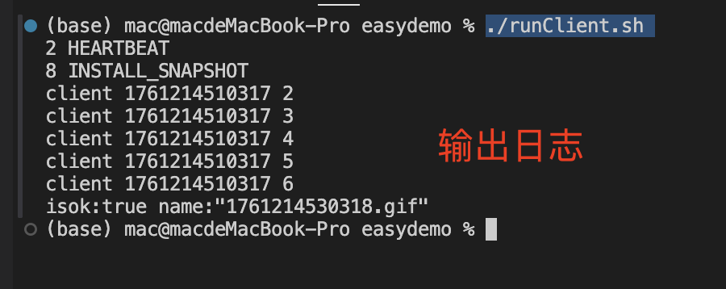

# 学习 gRPC 的使用

本项目是在学习一个开源项目`simple-raft`，看到内部数据通信使用 `gRPC`实现，就想摘出来和大家简单学习一下如何自己实现一个`gRPC`的客户端和服务端，算是为下一篇文件进行预热。

项目地址：https://github.com/gofish2020/easydemo 

运行方法：

1. 启动服务端：`./runServer.sh`
2. 启动客户端： `./runClient.sh `



*如果想重新编译 `proto`文件，运行 `./buildProto.sh`*


## 项目目标：

### 1.学习如何编写 `proto`文件

这里就是一个一般性的写法

```protobuf
// 固定的写法
syntax = "proto3";

package proto;

// 含义看下面第二部分介绍
option go_package = "easydemo/proto/raftpb;raftpb";

// 函数的输入参数
message FileContext {
    bool islastframe = 1;
    bytes context = 2;
    string ext = 3;
}

// 函数的输出参数
message FileInfoResp {
    bool isok = 1;
    string name = 2;
}

// 这里定义对象
service File {
    rpc sendfile( stream FileContext ) returns ( FileInfoResp) {} // 对象内部实现的函数
}
```

`Protobuf`数据类型和`Go`对应关系

| `double`   | `float64`                            |
| ---------- | ------------------------------------ |
| `float`    | `float32`                            |
| `int32`    | `int32`                              |
| `int64`    | `int64`                              |
| `uint32`   | `uint32`                             |
| `uint64`   | `uint64`                             |
| `sint32`   | `int32`                              |
| `sint64`   | `int64`                              |
| `fixed32`  | `uint32`                             |
| `fixed64`  | `uint64`                             |
| `sfixed32` | `int32`                              |
| `sfixed64` | `int64`                              |
| `bool`     | `bool`                               |
| `string`   | `string`                             |
| `bytes`    | `[]byte`                             |
| `enum`     | Go 中的枚举类型                      |
| `message`  | Go 中的结构体                        |
| `map`      | Go 中的map 类型                      |
| `oneof`    | Go 中的指针字段或空接口(interface{}) |
| `repeated` | Go 中的slice 类型                    |


### 2. option go_package 的含义解读

```
option go_package 格式为： 输出目录;包名 （注意中间有个分号）
例如：
option go_package = "easydemo/proto/hellopb;hellopb";

easydemo/proto/hellopb 表示编译好的*.go文件的输出目录，需要结合 -go_out 编译参数，才能知道真实的输出目录
easydemo/proto/hellopb 还有一层含义，编译好的 *.go 文件的引用路径
hellopb 表示编译出来的 *.go文件的包名（当然可以省略）自动用目录名作为包名
```


### 3.  一个 `proto`如何 `import`另外一个 `proto`

```protobuf
syntax = "proto3";
package proto;

// 导入其他的 *.proto 文件，该路径需要和编译指令参数 -I 配合着解读
import "proto/raft.proto";

service Hello{
    rpc send(proto.RaftMessage) returns(proto.RaftMessage) {}
}
```


### 4. protoc 编译指令介绍

编译指令和 `*.proto`文件有着内在的联系

```protobuf
protoc -I . --go_out=module=easydemo:.  --go-grpc_out=module=easydemo:.  proto/*.proto
```

```go
-I，--proto_path: 针对的是 *.proto 文件，依赖的文件的搜索目录，可以指定多个，例如 `-I . -I ..` 与 `*.proto` 文件中的 import 一起组成绝对的搜索路径

--go_out: 指定输出 Go 代码的目录，默认为当前目录。 和 *.proto 文件中的 option go_package 一起组成绝对路径 （如果存在module=easydemo 选项，会将输出路径中的【匹配的名字忽略】）；

大家可以尝试下这个编译指令，就能直观的看出不带 module=easydemo 这个参数的区别了
protoc -I . --go_out=:.  --go-grpc_out=module=easydemo:.  proto/*.proto

```


### 5. 实现 grpc client/server 

`gRPC`服务端

```go
// server/server.go
func Start() {

	// 8088监听端口
	lis, err := net.Listen("tcp", ":8088")

	if err != nil {

		fmt.Println("监听失败")
		return
	}

	// 创建 gprc 服务
	var opts []grpc.ServerOption
	srv := grpc.NewServer(opts...)

	// 注册服务端业务处理对象
	raftpb.RegisterRaftServer(srv, &Raft{})
	hellopb.RegisterHelloServer(srv, &Hello{})
	raftpb.RegisterFileServer(srv, &File{})

	// 启动服务
	fmt.Println("启动服务...")
	err = srv.Serve(lis)
	if err != nil {
		fmt.Println("启动失败")
		return
	}
}

```

`gRPC`客户端

```go
// client/client.go
type Client struct {
	conn *grpc.ClientConn
}

// 创建 grpc 客户端
func NewClient() *Client {

	var opts []grpc.DialOption
	opts = append(opts, grpc.WithTransportCredentials(insecure.NewCredentials())) // 不安全证书

	// 客户端拨号
	conn, err := grpc.NewClient(":8088", opts...)
	if err != nil {
		return nil
	}

	return &Client{
		conn: conn,
	}
}


// main.go

// 运行指令 go run main.go
cli := client.NewClient()

// 演示：普通的grpc函数调用
cli.Send(context.Background(), &raftpb.RaftMessage{
  MsgType: raftpb.MessageType_HEARTBEAT,
})

// 演示: 双向 stream
go cli.Consensus() // 在tcp上开一个client stream
time.Sleep(20 * time.Second)

// 单向 stream：客户端发送文件到服务
cli.SendFile("./snapshoot.gif")
```


### 6. 普通的 grpc调用

也是我们平时业务写的最多的，调用一次，返回一个结果

```go
// client/client.go
func (t *Client) Send(ctx context.Context, req *raftpb.RaftMessage) (*raftpb.RaftMessage, error) {

	// 创建 grpc Hello 客户端
	client := hellopb.NewHelloClient(t.conn)

	// 发送 req 返回res结果
	res, err := client.Send(context.Background(), req)
	if err != nil {
		fmt.Println(err)
		return nil, err
	}

	// 打印结果
	msgType := res.MsgType
	fmt.Println(msgType.Number(), msgType.String())

	// 再发送一次  req 返回res结果
	req.MsgType = raftpb.MessageType_INSTALL_SNAPSHOT
	res, err = client.Send(context.Background(), req)
	if err != nil {
		fmt.Println(err)
		return nil, err
	}

	// 打印结果
	msgType1 := res.MsgType
	fmt.Println(msgType1.Number(), msgType1.String())

	return res, nil

}

// server/server.go

// Hello对象：我们平时写的最多远程过程调用的业务实现
type Hello struct {
	hellopb.UnimplementedHelloServer
}

func (t *Hello) Send(ctx context.Context, r *raftpb.RaftMessage) (*raftpb.RaftMessage, error) {
	return &raftpb.RaftMessage{
		MsgType: r.MsgType,
	}, nil
}
```

对应的`proto`中的写法如下

```
service Hello{
    rpc send(proto.RaftMessage) returns(proto.RaftMessage) {}
}
```


### 7. 具有双向流 stream能力的 grpc

可以实现客户端和服务端之间的数据相互推送

```go
// client/client.go

func (t *Client) Consensus() {

	// 创建 grpc Raft 客户端
	raftClient := raftpb.NewRaftClient(t.conn)

	// 可以看到这里和我们普通的 rpc调用直接返回结果不一样，而是返回了一个新对象
	raftClientStream, err := raftClient.Consensus(context.Background())

	if err != nil {
		fmt.Println(err)
		return
	}

	// 通过 raftClientStream 我们可以持续的与服务端【发送和接收数据】
	from := uint64(time.Now().UnixMilli())
	msg1 := &raftpb.RaftMessage{}
	msg1.From = from
	msg1.Term = 1
	raftClientStream.Send(msg1) // 发送一个数据包

	for {
		msg, err := raftClientStream.Recv() // 接收
		if err == io.EOF {
			raftClientStream.CloseSend()
			raftClientStream = nil
			return
		}

		if err != nil {
			raftClientStream.CloseSend()
			raftClientStream = nil
			return
		}
		fmt.Println("client", from, msg.Term) // 这个 Term值被服务端不断的 +1
		raftClientStream.Send(msg)            // 发送
		time.Sleep(5 * time.Second)
	}

}

// server/server.go

type Raft struct {
	raftpb.UnimplementedRaftServer
}

func (t *Raft) Consensus(serverStream raftpb.Raft_ConsensusServer) error {

	// 接收消息
	for {
		msg, err := serverStream.Recv()
		if err == io.EOF {
			fmt.Println("server1", err)
			return nil
		}
		if err != nil {
			fmt.Println("server2", err)
			return nil
		}

		fmt.Println("server", msg.From, msg.Term)
		msg.Term++ // 将消息的 term+1 再发回给客户端
		serverStream.Send(msg)
		time.Sleep(5 * time.Second)
	}
}
```

对应的 proto 写法如下

```go
// 入参和出参都限定了 stream
service Raft {
    rpc consensus(stream RaftMessage) returns (stream RaftMessage) {}
}
```

可以看到这里多了一个 `stream`的限定

### 8. 利用 `stream`实现文件发送`sendfile`到服务端

如果我们想通过 grpc 实现内部文件传递的功能，我们应该如何实现呢？？？？
我们的 proto定义如下

```go
// 只对入参限定 stream
service File {
    rpc sendfile( stream FileContext ) returns ( FileInfoResp) {}
}
```

客户端实现如下：
```go
// client/client.go
func (t *Client) SendFile(fileNanme string) error {

	// 创建 grpc File 客户端
	fileClient := raftpb.NewFileClient(t.conn)
	// 返回一个 fileStream 对象
	fileStream, err := fileClient.Sendfile(context.Background())
	if err != nil {
		return err
	}

	// 打开本地文件
	file, err := os.Open(fileNanme)
	if err != nil {
		return err
	}
	defer file.Close()

	// 创建一个 Reader
	reader := bufio.NewReader(file)
	buffer := make([]byte, 1024) // 每次读取 1024 字节

	for {
		// 读取数据到缓冲区，每次读取 1024 字节
		_, err := reader.Read(buffer)
		if err != nil {
			if err == io.EOF { // 文件读取完毕
				fileinfo := &raftpb.FileContext{}
				fileinfo.Islastframe = true // 最后一帧标记
				fileinfo.Context = buffer
				pos := strings.LastIndex(file.Name(), ".")
				if pos != -1 {
					fileinfo.Ext = file.Name()[pos:]
				}
				fileStream.Send(fileinfo) // 发送最后一帧文件数据
			}
			break
		}

		// 持续的发送文件数据
		fileinfo := &raftpb.FileContext{}
		fileinfo.Islastframe = false //不是最后一帧
		fileinfo.Context = buffer
		fileStream.Send(fileinfo)

	}
	// 发送完毕，等待【接收服务端】的返回
	res, err := fileStream.CloseAndRecv()
	if err != nil {
		fmt.Println(res, err)
		return err
	}
	fmt.Println(res)
	return nil
}
```

服务端实现如下：

```go
// server/server.go
// File对象演示：客户端通过stream发送文件到服务端，最后服务端接收完成以后，回复一个确认消息
type File struct {
	raftpb.UnimplementedFileServer
}

func (t *File) Sendfile(req raftpb.File_SendfileServer) error {

	fileName := fmt.Sprintf("%d", time.Now().UnixMilli())
	file, err := os.OpenFile(fileName, os.O_CREATE|os.O_WRONLY|os.O_APPEND, os.ModePerm) // 创建临时文件
	if err != nil {
		return err
	}

	ext := ""
	for {
		fileContext, err := req.Recv()
		if err == io.EOF {
			file.Close()
			os.Remove(file.Name())
			fmt.Println("eof", err)
			return err
		}
		if err != nil {
			file.Close()
			os.Remove(file.Name())
			fmt.Println("err", err)
			return err
		}

		file.Write(fileContext.Context) // 接收文件数据

		if fileContext.Islastframe { // 最后一帧数据
			ext = fileContext.Ext // 记录文件后缀
			break
		}
	}

	file.Close()
	if ext != "" { //存在后缀，重命名文件
		os.Rename(fileName, fileName+ext)
	}

	req.SendAndClose(&raftpb.FileInfoResp{ // 返回文件名，告知已经接收完成
		Isok: true,
		Name: fileName + ext,
	})
	return nil
}
```


### 9. 为啥 gRPC 具有 stream的能力

因为 `google`的 `gRPC`的底层通信利用了`http2.0`通信协议。之前的 `http1.1`通信协议，属于应答式的，客户端请求服务端，然后服务端返回数据，服务端是无法主动给客户端推送数据了。但是传输层的`TCP`协议，其实本身就是全双工的协议，是可以客户端和服务端互相推送数据的，只是`http1.1`协议本身局限所导致的，所以，后来大家就搞出来了`WebSocket`这个东西，就是在`http1.1`协议的基础上，进行协议升级，这样客户端和服务端之间就具有了互相推送数据的能力。但是这个`WebSocket`毕竟不是`http1.1`协议本身的东西，而且`http1.1`协议本身存在着一些问题，比如：队头阻塞，协议头臃肿等等，所以后来就出现了 `http2.0`，该协议原生就支持 `stream`的能力，而且对`http1.1`协议存在的问题进行了优化升级，比如：头部编码，二进制帧，并发传输等

如果感兴趣的话可以看下如下两篇八股文，立马就明白了

https://xiaolincoding.com/network/2_http/http2.html

https://xiaolincoding.com/network/2_http/http_websocket.html

当然还有一个`http3.0`协议，不过是传输层是基于 `UDP`的，真正落实应用起来，道阻且长，感兴趣的也可以看下实现原理

https://xiaolincoding.com/network/2_http/http3.html
